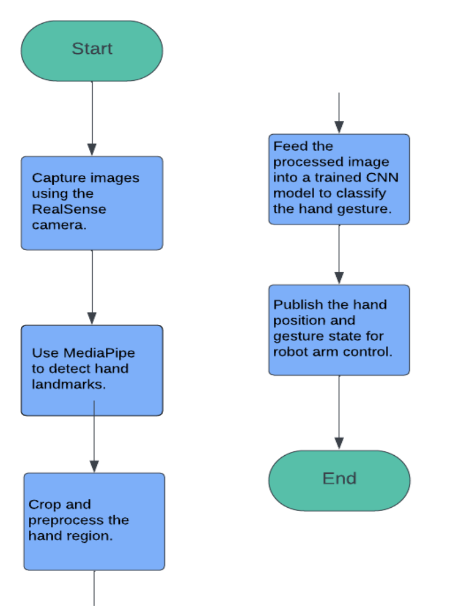
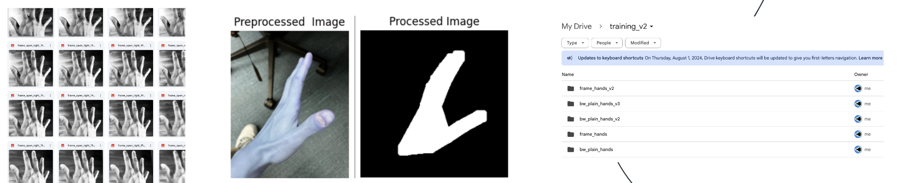

# Intro Robotics Final Project
### Group members: David Suh, Simon Mahns, Karim Sharaf, Kseniia Korotenko

## Description:
We use a depth camera, computer vision, custom neural nets, and inverse kinematics to introduce a novel way of controlling the turtlebot arm - open air hand imitation.

To demonstrate the functionality of this method we created a game where players attempt to control the hand to drag and drop tubes with their hand. The rules are as follows:
- knocking over tubes (+1 point) 
- dragging and dropping tubes in the goal area (+2 points)

The player who accumulates the most points in 2 minutes wins.

### Why its interesting
- Use of a novel sensor (depth camera)
- Neural Net (CNN) built from scratch with pytorch
- Dataset created from scratch/from online source
- OpenCV used extensively for preprocessing
- 3+ joint Inverse Kinematics problem
- Implementing a (not so intuitive) HCI/HRI solution for augmenting a robot arm

### Demo
Our most skilled operator (David) vs our less skilled operator (Simon)  

Close up on the CV/ML part (note x/y/x) (left) plus previous testing (right)  

## System Architecture
### Computer Vision Component: Hand Gesture Detection
This code is in the file `hand_detection.py`. The rospy node is called `hand_tracker`. First, in this file, load the CNN model. We also do some logistics such as initializing MediaPipe and the RealSense depth camera. We also set the white balance to make sure the image is processed correctly. Upon init, the `hand_tracker` node first captures two things from the first frame. 
1. The pixel width of an AR tag on the ground (used for converting pixels to meters)
2. The distance from the ground (used to calculate z, which is meters from the ground)

Then as the node continues to run, it gets an image from the realsense camera, gets the location of the hand using mediapipe, calculates bounding box for the hand, crops the image, and preprocesses the resulting image of a hand to be fed to our custom model for fist detection. (The preprocessing involves some resizing, format change, normalization etc.) Then we get the model's prediction, and publish the hand position and state (open/closed) as based on this prediction. Then we display the image for debugging. 

Simplified workflow diagram 

### Inverse Kinematics Component: Robot Arm Manipulation
This code is in the file `arm_motion.py`. The ros node running in this file is called `arm_control`. It initializes arm, resets arm and gripper position, and sets up subscribers on initialization. The heart of this node are two callback functions. The first one is `hand_position_callback` that moves the robot arm according to the hand position received (`PointStamped` type). The frequency of update is capped to avoid bugs. We get current arm joint values, and use helper functions `_get_joint_1`, `_get_joint_2`, `_get_joint_3` to compute the desired joint positions based on the received ros message. Then we move the arm and stop after the movement is complete. The second callback function, `hand_state_callback`, updates the gripper position to be open or closed based on the Boolean message received. \
As for the helper functions: \
`_get_joint_1` gets the position for the swivel servo, mapping the `x, y` hand position to a $0$ - $180$ degree range ($0$ - $\pi$ radians). \
`_get_joint_2` gets the position for the tilt servo, mapping the distance of the hand from the ground in meters to a $0$ - $90$ degree range ($0$ - $\frac{\pi}{2}$ radians). \
`_get_joint_3` gets the position for the elbow join, mapping the angular distance of the hand from the origin to a $0$ - $90$ degree range ($0$ - $\frac{\pi}{2}$ radians).

Our biggest issue with this part were control aborts. To combat this we employed a couple of things. We reached the values used through hours of trial and error.
- Throttling real sense camera fps (30) to 4
- Clamping max movement per frame to `n` amount (specified at top of the file)
- Adding micro sleeps

## ROS Node Diagram
Please include a visual diagram representing all of the ROS nodes, ROS topics, and publisher/subscriber connections present in your final project. \
We have two nodes: `hand_tracker` in `hand_detection.py` and `arm_control` in `arm_motion.py`. `hand_tracker` publishes to ros topics `hand_center` (hand position, PointStamped message) and `hand open`(flag which determines whether the hand should be open, Bool message). The node `arm_control` is subscribed to these topics. \

## Execution
We created a launch file `final.launch`. So it is enough to run: `roslaunch final_project final.launch`. This launch file launches OpenMANIPULATOR Bringup, MoveIt configuration for the robot arm, and runs the hand detection and arm motion nodes. (The data stream from the depth camera is set up in the hand detection node.) \
The second step is for a human to position themselves under the depth camera and operate the robot using hand gestures! If we want two (or more) robots to compete, we need two (or more) identical setups.
1. roscore
2. ssh into your robot and run set_ip/bringup
3. run roslaunch final_project final.launch in the root of this repo

## Challenges, Future Work, and Takeaways

### Challenges:
Perhaps the biggest challenge was learning to work with the MoveIt framework. While we started out with the inverse kinematics theory from class slides, we quickly realized that the actual limitations of the robot arm, and the capabilities of the MoveIt API, mean that we have to adjust our plans. We ended up implementing a simpler model than we originally planned, making sure that each joint corresponds to one specific direction of movement. \
It is also interesting that our ML model for hand gesture detention is home grown! We had a lot of challenges to get the model where it is, and tried many things such as creating many custom datasets and playing with dataprocessing. Some relics of this period can be found in the `/training` folder (training, benchmark pipelines, preprocessing testing, dataset creation)

Some of images captured on the way 

### Future Work:
If we had more time, we would definitely want to try and implement this project without the MoveIt library. We would consider controlling the arm's servos by programming their positions "raw", without the MoveIt API. Plus, instead of performing the robot arm position computation on a PC, we would consider doing it directly on the robot's raspberry pi in order to eliminate latency limitations. 

### Takeaways:
- Learning how to use a depth camera and what we can accomplish with it!
- Learning how to implement somewhat complex inverse kinematics in a real-life project, and what practical limitations (latency, robot's arm structure) exist.
- How to train a CNN model from scratch, neural net architecture. How to create a good training dataset
- How to drive a robot with just your hand (very hard)

